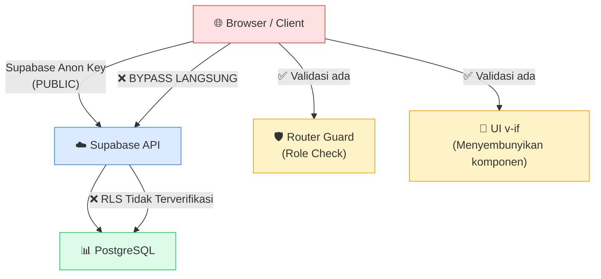

# 🔴 Security Audit Report — Habi Jaya Fuel Management System (MV-2)

**Auditor:** Penetration Tester & Code Auditor  
**Target:** Vue.js + Supabase SPA — Fuel Station Management  
**Date:** 2026-07-25  
**Scope:** Business Logic, Access Control, IDOR, Tenant Leakage, Parameter Tampering, Race Conditions

---

## Executive Summary

Aplikasi ini adalah sistem manajemen SPBU dengan dua role: **Manajer** (admin dashboard, laporan, tim, pengaturan) dan **Operator** (input transaksi BBM). Backend menggunakan **Supabase** (PostgreSQL + Auth + RLS). 

Audit ini menemukan **10 kerentanan signifikan**, di mana **3 berkategori CRITICAL** dan **4 HIGH**. Mayoritas masalah berakar pada arsitektur *"fat client / thin server"* — di mana logika bisnis dan kontrol akses dipercayakan sepenuhnya pada kode frontend, tanpa enforcement yang memadai di sisi server/database (RLS).

> [!CAUTION]
> **Temuan utama:** Seluruh validasi bisnis kritis (pembatasan pengisian ganda, kalkulasi harga, role-based access pada data) hanya diimplementasikan di frontend. Penyerang dengan akses ke `anon key` Supabase yang terekspos di client-side dapat **bypass 100% logika bisnis** dengan memanggil Supabase API secara langsung.

---

## Daftar Temuan

| # | Severity | Kategori | Judul | File Utama |
|---|----------|----------|-------|------------|
| 1 | 🔴 CRITICAL | Business Logic Bypass | Bypass Pembatasan Pengisian Ganda (1x/Hari) | [useTransactionAction.js](file:///c:/Users/KaliCodeS3/Documents/Project/MV-2/src/composables/useTransactionAction.js) |
| 2 | 🔴 CRITICAL | Parameter Tampering | Manipulasi Harga & Volume Transaksi | [TransactionForm.vue](file:///c:/Users/KaliCodeS3/Documents/Project/MV-2/src/components/operator/TransactionForm.vue) |
| 3 | 🔴 CRITICAL | Broken Access Control | Operator Dapat Mengakses Fitur Manajer via API Langsung | [FuelPriceForm.vue](file:///c:/Users/KaliCodeS3/Documents/Project/MV-2/src/components/settings/FuelPriceForm.vue), [ShiftForm.vue](file:///c:/Users/KaliCodeS3/Documents/Project/MV-2/src/components/settings/ShiftForm.vue) |
| 4 | 🟠 HIGH | IDOR | Akses Data Transaksi Lintas Operator | [useTransactionHistory.js](file:///c:/Users/KaliCodeS3/Documents/Project/MV-2/src/composables/useTransactionHistory.js) |
| 5 | 🟠 HIGH | Race Condition (TOCTOU) | Pengisian Ganda via Race Condition | [useTransactionAction.js](file:///c:/Users/KaliCodeS3/Documents/Project/MV-2/src/composables/useTransactionAction.js) |
| 6 | 🟠 HIGH | Business Logic Bypass | Manipulasi Harga BBM oleh Pengguna Tidak Berwenang | [FuelPriceForm.vue](file:///c:/Users/KaliCodeS3/Documents/Project/MV-2/src/components/settings/FuelPriceForm.vue) |
| 7 | 🟠 HIGH | Data Leakage | Kebocoran Data Seluruh Transaksi & Tim | [useDashboard.js](file:///c:/Users/KaliCodeS3/Documents/Project/MV-2/src/composables/useDashboard.js), [useTeam.js](file:///c:/Users/KaliCodeS3/Documents/Project/MV-2/src/composables/useTeam.js) |
| 8 | 🟡 MEDIUM | Credential Exposure | Supabase Anon Key Terekspos di `.env` Client-Side | [.env](file:///c:/Users/KaliCodeS3/Documents/Project/MV-2/.env) |
| 9 | 🟡 MEDIUM | Business Logic Flaw | Validasi Input Hanya Client-Side, Nilai Negatif/Nol Diterima | [TransactionForm.vue](file:///c:/Users/KaliCodeS3/Documents/Project/MV-2/src/components/operator/TransactionForm.vue) |
| 10 | 🟡 MEDIUM | Broken Access Control | Route `/settings` Tanpa Proteksi Role | [router/index.js](file:///c:/Users/KaliCodeS3/Documents/Project/MV-2/src/router/index.js) |

---

## Temuan Detail

---

### 🔴 VULN-01: Bypass Pembatasan Pengisian Ganda (1x/Hari)
**Severity:** CRITICAL  
**Kategori:** Business Logic Bypass  
**CWE:** CWE-841 (Improper Enforcement of Behavioral Workflow)

#### Deskripsi

Sistem memiliki aturan bisnis: *setiap kendaraan hanya boleh mengisi BBM 1x per hari*. Pengecekan ini dilakukan di [checkPlateStatus()](file:///c:/Users/KaliCodeS3/Documents/Project/MV-2/src/composables/useTransactionAction.js#L11-L66) yang query ke tabel `transaksi_pertalite` dan menampilkan modal peringatan di frontend. **Namun**, fungsi [submitTransaction()](file:///c:/Users/KaliCodeS3/Documents/Project/MV-2/src/composables/useTransactionAction.js#L68-L100) **tidak melakukan pengecekan duplikat sama sekali** sebelum `INSERT`.

#### Kode Bermasalah
```javascript
// useTransactionAction.js L68-L86
const submitTransaction = async (formData, vehicleType) => {
  // ❌ TIDAK ADA pengecekan duplikat di sini!
  const { error } = await supabase.from('transaksi_pertalite').insert({
    plat_nomor: plat,
    liter: parseFloat(liter),
    harga: total_harga,
    jenis_kendaraan: vehicleType,
    operator_id: authStore.user?.id
  })
}
```

#### Skenario Serangan (Step-by-Step)

1. **Penyerang** login sebagai operator yang sah
2. Buka browser DevTools → Console
3. Panggil Supabase client secara langsung:
   ```javascript
   // Bypass seluruh UI — langsung INSERT
   const { data, error } = await supabase
     .from('transaksi_pertalite')
     .insert({
       plat_nomor: 'KT 1234 AB',
       liter: 50,
       harga: 500000,
       jenis_kendaraan: 'Mobil',
       operator_id: '<user-id>'
     })
   ```
4. Ulangi berkali-kali — **tidak ada batasan di database**
5. Kendaraan yang sama tercatat mengisi BBM berkali-kali dalam sehari

#### Dampak
- Penyelewengan BBM subsidi (kendaraan mendapat BBM melebihi kuota)
- Data transaksi fiktif / inflasi volume
- Kerugian finansial langsung bagi perusahaan

#### Solusi Arsitektural

```sql
-- 1. Buat UNIQUE constraint atau trigger di PostgreSQL
CREATE OR REPLACE FUNCTION check_daily_fuel_limit()
RETURNS TRIGGER AS $$
BEGIN
  IF EXISTS (
    SELECT 1 FROM transaksi_pertalite
    WHERE plat_nomor = NEW.plat_nomor
      AND waktu_pencatatan::date = CURRENT_DATE
      AND waktu_pencatatan >= (CURRENT_DATE + interval '6 hours')
  ) THEN
    RAISE EXCEPTION 'Kendaraan % sudah mengisi hari ini', NEW.plat_nomor;
  END IF;
  RETURN NEW;
END;
$$ LANGUAGE plpgsql;

CREATE TRIGGER trg_daily_fuel_limit
  BEFORE INSERT ON transaksi_pertalite
  FOR EACH ROW EXECUTE FUNCTION check_daily_fuel_limit();
```

---

### 🔴 VULN-02: Manipulasi Harga & Volume Transaksi (Parameter Tampering)
**Severity:** CRITICAL  
**Kategori:** Parameter Tampering  
**CWE:** CWE-472 (External Control of Assumed-Immutable Web Parameter)

#### Deskripsi

Harga total (`total_harga`) dihitung sepenuhnya di frontend ([TransactionForm.vue L345](file:///c:/Users/KaliCodeS3/Documents/Project/MV-2/src/components/operator/TransactionForm.vue#L342-L347)) dan dikirim langsung ke database tanpa validasi server-side. Penyerang dapat memodifikasi nilai `liter` dan `total_harga` sebelum dikirim.

#### Kode Bermasalah

```javascript
// TransactionForm.vue L342-347 — Harga dihitung di client
emit('submit', {
  plat_nomor: form.value.plat_nomor,
  liter: form.value.liter,
  total_harga: liter * hargaPerLiter.value  // ← kalkulasi frontend
})

// useTransactionAction.js L80-86 — Langsung INSERT tanpa validasi
await supabase.from('transaksi_pertalite').insert({
  harga: total_harga,  // ← diterima apa adanya dari client
  liter: parseFloat(liter),  // ← bisa dimanipulasi
})
```

#### Skenario Serangan

1. Operator (atau penyerang yang mendapat session operator) membuka transaksi
2. Sebelum submit, intercept request menggunakan DevTools/Burp:
   ```javascript
   // Manipulasi: catat 100 liter padahal sebenarnya 5 liter
   await supabase.from('transaksi_pertalite').insert({
     plat_nomor: 'KT 1234 AB',
     liter: 100,          // ← fiktif (seharusnya 5L)
     harga: 50000,        // ← harga untuk 5L, bukan 100L
     jenis_kendaraan: 'Mobil',
     operator_id: '<id>'
   })
   ```
3. Selisih 95 liter bisa "hilang" atau dijual secara ilegal

#### Dampak
- Penyelewengan BBM berskala besar
- Manipulasi laporan pendapatan
- Kerugian finansial signifikan

#### Solusi Arsitektural

```sql
-- 1. Kalkulasi harga WAJIB di database, bukan di frontend
CREATE OR REPLACE FUNCTION fn_insert_transaction(
  p_plat TEXT, p_liter NUMERIC, p_jenis TEXT
)
RETURNS void AS $$
DECLARE
  v_price NUMERIC;
BEGIN
  -- Ambil harga resmi dari tabel fuel_prices
  SELECT price_per_liter INTO v_price
  FROM fuel_prices
  WHERE fuel_type ILIKE '%pertalite%'
  LIMIT 1;

  INSERT INTO transaksi_pertalite (plat_nomor, liter, harga, jenis_kendaraan, operator_id)
  VALUES (p_plat, p_liter, p_liter * v_price, p_jenis, auth.uid());
END;
$$ LANGUAGE plpgsql SECURITY DEFINER;

-- 2. CABUT akses INSERT langsung dari client
REVOKE INSERT ON transaksi_pertalite FROM authenticated;

-- 3. Tambahkan CHECK constraint
ALTER TABLE transaksi_pertalite
  ADD CONSTRAINT chk_liter_range CHECK (liter > 0 AND liter <= 200),
  ADD CONSTRAINT chk_harga_positive CHECK (harga > 0);
```

---

### 🔴 VULN-03: Operator Dapat Mengakses Fitur Manajer via API
**Severity:** CRITICAL  
**Kategori:** Broken Access Control  
**CWE:** CWE-285 (Improper Authorization)

#### Deskripsi

Proteksi role "manajer" hanya dilakukan di **dua tempat**:
1. **Router guard** ([router/index.js L89-97](file:///c:/Users/KaliCodeS3/Documents/Project/MV-2/src/router/index.js#L89-L97)) — hanya mencegah navigasi UI
2. **`v-if="isManager"`** di [SettingsView.vue L25](file:///c:/Users/KaliCodeS3/Documents/Project/MV-2/src/views/SettingsView.vue#L25) — hanya menyembunyikan komponen

Namun, **tabel Supabase** (`fuel_prices`, `shift_config`, `team_members`) kemungkinan besar tidak memiliki RLS yang membatasi akses berdasarkan role. Operator yang login memiliki **session JWT yang valid** dan dapat langsung memanggil Supabase API.

#### Skenario Serangan

1. Login sebagai **operator** (bukan manajer)
2. Buka DevTools Console:
   ```javascript
   // Ubah harga BBM — sebagai operator!
   await supabase.from('fuel_prices').update({
     price_per_liter: 1  // ← Harga BBM jadi Rp1/liter
   }).eq('fuel_type', 'Pertalite')

   // Baca data seluruh tim
   const { data } = await supabase.from('team_members').select('*')
   console.log(data) // ← Semua email, role, last_sign_in terekspos

   // Ubah shift operasional
   await supabase.from('shift_config').update({
     start_time: '00:00', end_time: '23:59'
   }).eq('shift_name', 'Shift 1')
   ```

#### Dampak
- Operator dapat mengubah harga BBM → kalkulasi pendapatan kacau
- Operator dapat melihat data privasi seluruh tim
- Operator dapat mengubah konfigurasi sistem

#### Solusi Arsitektural

```sql
-- RLS untuk fuel_prices — hanya manajer yang bisa update
ALTER TABLE fuel_prices ENABLE ROW LEVEL SECURITY;

CREATE POLICY "Manajer can manage fuel_prices"
ON fuel_prices FOR ALL
USING (
  EXISTS (
    SELECT 1 FROM user_roles
    WHERE user_id = auth.uid() AND role = 'manajer'
  )
);

CREATE POLICY "All authenticated can read fuel_prices"
ON fuel_prices FOR SELECT
USING (auth.role() = 'authenticated');

-- Ulangi pola serupa untuk shift_config dan team_members
```

---

### 🟠 VULN-04: IDOR — Akses Data Transaksi Lintas Operator
**Severity:** HIGH  
**Kategori:** Insecure Direct Object Reference (IDOR)  
**CWE:** CWE-639 (Authorization Bypass Through User-Controlled Key)

#### Deskripsi

Query di [useTransactionHistory.js](file:///c:/Users/KaliCodeS3/Documents/Project/MV-2/src/composables/useTransactionHistory.js#L28-L32) dan [useDashboard.js](file:///c:/Users/KaliCodeS3/Documents/Project/MV-2/src/composables/useDashboard.js#L21-L24) mengambil data dari `transaksi_pertalite` **tanpa filter `operator_id`**. Ini berarti:

- Setiap operator bisa melihat **semua transaksi** dari semua operator
- Tidak ada isolasi data per operator

```javascript
// useDashboard.js L21-24 — SELECT * tanpa filter operator
let query = supabase
  .from('transaksi_pertalite')
  .select('*')  // ← SEMUA data, tanpa filter operator_id
  .order('waktu_pencatatan', { ascending: false })
```

#### Skenario Serangan

1. Operator A login dan buka DevTools
2. ```javascript
   const { data } = await supabase
     .from('transaksi_pertalite')
     .select('*')
   // ← Mendapat SEMUA transaksi dari semua operator
   ```
3. Data sensitif seperti plat nomor, volume, harga, dan waktu transaksi dari operator lain terekspos

#### Solusi Arsitektural

```sql
-- RLS: Operator hanya bisa melihat transaksi miliknya sendiri
CREATE POLICY "Operators see own transactions"
ON transaksi_pertalite FOR SELECT
USING (
  operator_id = auth.uid()
  OR EXISTS (
    SELECT 1 FROM user_roles
    WHERE user_id = auth.uid() AND role = 'manajer'
  )
);
```

---

### 🟠 VULN-05: Race Condition (TOCTOU) pada Pengisian Ganda
**Severity:** HIGH  
**Kategori:** Race Condition / Time-of-Check-to-Time-of-Use  
**CWE:** CWE-367 (Time-of-check Time-of-use)

#### Deskripsi

Flow transaksi memiliki celah waktu (*time window*) antara **pengecekan duplikat** (`checkPlateStatus`) dan **penyimpanan** (`submitTransaction`). Kedua operasi ini **bukan atomic** — ada jeda waktu di mana operator lain (atau tab browser lain) bisa mengirim transaksi untuk plat yang sama.

```
Tab 1: checkPlateStatus("KT 1234 AB") → ✅ Belum ada hari ini
          ↓ (delay beberapa detik saat user mengisi form)
Tab 2: checkPlateStatus("KT 1234 AB") → ✅ Belum ada hari ini
          ↓
Tab 1: submitTransaction("KT 1234 AB")  → INSERT berhasil
Tab 2: submitTransaction("KT 1234 AB")  → INSERT juga berhasil! ← DUPLIKAT
```

#### Skenario Serangan

1. Buka 2 tab browser atau gunakan script otomatis
2. Kedua tab melakukan `checkPlateStatus` hampir bersamaan untuk plat yang sama
3. Kedua pengecekan menghasilkan `hasRefueledToday: false`
4. Kedua tab submit transaksi → 2 INSERT berhasil
5. Kendaraan mendapat BBM 2x dalam sehari

#### Solusi Arsitektural

```sql
-- Gabung check + insert menjadi satu operasi atomic
CREATE OR REPLACE FUNCTION fn_safe_insert_transaction(
  p_plat TEXT, p_liter NUMERIC, p_jenis TEXT
)
RETURNS jsonb AS $$
DECLARE
  v_existing INT;
  v_price NUMERIC;
BEGIN
  -- Lock row-level untuk mencegah race condition
  PERFORM pg_advisory_xact_lock(hashtext(p_plat || CURRENT_DATE::text));

  SELECT COUNT(*) INTO v_existing
  FROM transaksi_pertalite
  WHERE plat_nomor = p_plat
    AND waktu_pencatatan::date = CURRENT_DATE;

  IF v_existing > 0 THEN
    RETURN jsonb_build_object('success', false, 'reason', 'already_refueled');
  END IF;

  SELECT price_per_liter INTO v_price
  FROM fuel_prices WHERE fuel_type ILIKE '%pertalite%' LIMIT 1;

  INSERT INTO transaksi_pertalite (plat_nomor, liter, harga, jenis_kendaraan, operator_id)
  VALUES (p_plat, p_liter, p_liter * v_price, p_jenis, auth.uid());

  RETURN jsonb_build_object('success', true);
END;
$$ LANGUAGE plpgsql SECURITY DEFINER;
```

---

### 🟠 VULN-06: Manipulasi Harga BBM oleh Pengguna Tidak Berwenang
**Severity:** HIGH  
**Kategori:** Business Logic Bypass / Privilege Escalation  
**CWE:** CWE-269 (Improper Privilege Management)

#### Deskripsi

[FuelPriceForm.vue](file:///c:/Users/KaliCodeS3/Documents/Project/MV-2/src/components/settings/FuelPriceForm.vue#L41-L69) langsung melakukan `upsert` ke tabel `fuel_prices` tanpa validasi role server-side. Proteksi hanya berupa `v-if="isManager"` di template — sebuah **UI-only guard**.

```javascript
// FuelPriceForm.vue L54-57 — upsert tanpa authz check
const { data, error } = await supabase
  .from('fuel_prices')
  .upsert(updates)  // ← Tidak ada pengecekan role!
  .select()
```

Hal yang sama berlaku untuk [ShiftForm.vue L48-51](file:///c:/Users/KaliCodeS3/Documents/Project/MV-2/src/components/settings/ShiftForm.vue#L48-L51).

#### Skenario Serangan

1. Login sebagai operator
2. Ubah harga Pertalite menjadi Rp 1:
   ```javascript
   await supabase.from('fuel_prices').upsert({
     fuel_type: 'Pertalite',
     price_per_liter: 1
   })
   ```
3. Seluruh kalkulasi transaksi yang bergantung pada `fetchActiveFuelPrice()` di [TransactionForm.vue L250-264](file:///c:/Users/KaliCodeS3/Documents/Project/MV-2/src/components/operator/TransactionForm.vue#L250-L264) akan menggunakan harga Rp 1

#### Dampak
- Pendapatan tercatat Rp 1 per liter → kerugian masif
- Laporan keuangan menjadi tidak valid

#### Solusi
Lihat solusi RLS pada VULN-03.

---

### 🟠 VULN-07: Kebocoran Data Seluruh Transaksi & Tim
**Severity:** HIGH  
**Kategori:** Tenant Data Leakage / Information Disclosure  
**CWE:** CWE-200 (Exposure of Sensitive Information)

#### Deskripsi

Beberapa query menggunakan `.select('*')` tanpa filter ketat:

| File | Query | Data Terekspos |
|------|-------|----------------|
| [useDashboard.js L21-24](file:///c:/Users/KaliCodeS3/Documents/Project/MV-2/src/composables/useDashboard.js#L21-L24) | `select('*')` dari `transaksi_pertalite` | Semua transaksi semua operator |
| [useTeam.js L13-16](file:///c:/Users/KaliCodeS3/Documents/Project/MV-2/src/composables/useTeam.js#L13-L16) | `select('*')` dari `team_members` | Email, role, last sign in semua staf |
| [useExcelExport.js L31-37](file:///c:/Users/KaliCodeS3/Documents/Project/MV-2/src/composables/useExcelExport.js#L31-L37) | `select('*')` paginasi | Seluruh data termasuk `operator_id` |

#### Skenario Serangan

1. Login sebagai **operator biasa**
2. Panggil API langsung:
   ```javascript
   // Dapatkan data seluruh tim — termasuk email admin
   const { data } = await supabase.from('team_members').select('*')

   // Dapatkan semua transaksi untuk analisis
   const { data: trx } = await supabase
     .from('transaksi_pertalite')
     .select('*')
     .order('waktu_pencatatan', { ascending: false })
     .limit(10000)
   ```
3. Data dapat diekspor dan disebarkan

#### Solusi Arsitektural

```sql
-- RLS: team_members hanya bisa dibaca manajer
CREATE POLICY "Only managers can view team"
ON team_members FOR SELECT
USING (
  EXISTS (
    SELECT 1 FROM user_roles
    WHERE user_id = auth.uid() AND role = 'manajer'
  )
);
```

---

### 🟡 VULN-08: Supabase Credentials Exposure (Design Pattern)
**Severity:** MEDIUM  
**Kategori:** Credential Exposure  
**CWE:** CWE-312 (Cleartext Storage of Sensitive Information)

#### Deskripsi

File [.env](file:///c:/Users/KaliCodeS3/Documents/Project/MV-2/.env) berisi `VITE_SUPABASE_URL` dan `VITE_SUPABASE_ANON_KEY`. Karena prefix `VITE_`, nilai ini **di-embed ke bundle JavaScript** saat build dan dapat dilihat oleh siapapun yang mengakses website.

```
VITE_SUPABASE_URL=https://rsjwipzlncfzrlcxmung.supabase.co
VITE_SUPABASE_ANON_KEY=eyJhbGciOiJIUzI1NiIs...
```

> [!NOTE]
> Ini memang **design pattern** Supabase (anon key dimaksudkan publik). **Namun**, ini hanya aman **jika dan hanya jika** Row Level Security (RLS) dikonfigurasi dengan benar di setiap tabel. Berdasarkan analisis kode, terdapat indikasi kuat bahwa **RLS tidak di-enforce** pada beberapa tabel kritis.

#### Dampak
- Tanpa RLS yang benar, siapapun (bahkan tanpa login) yang memiliki anon key bisa mengakses database secara langsung
- `.env` file juga terkomit ke Git (tidak ada `.env` di `.gitignore` patterns yang terlihat)

#### Solusi
1. **Pastikan RLS diaktifkan** pada SEMUA tabel
2. **Audit Supabase Dashboard** → Pastikan tidak ada tabel tanpa RLS
3. Tambahkan `.env` ke `.gitignore` (jika belum)
4. Rotate anon key jika pernah terkomit ke repo publik

---

### 🟡 VULN-09: Validasi Input Hanya Client-Side
**Severity:** MEDIUM  
**Kategori:** Business Logic Flaw / Input Validation Bypass  
**CWE:** CWE-602 (Client-Side Enforcement of Server-Side Security)

#### Deskripsi

Seluruh validasi input di [TransactionForm.vue](file:///c:/Users/KaliCodeS3/Documents/Project/MV-2/src/components/operator/TransactionForm.vue) hanya berjalan di browser:

- Validasi format plat nomor (L40, L162-177) — hanya regex frontend
- Validasi liter > 0 (L337) — hanya `if` statement frontend
- Pengecekan `checkingPlate` (L425) — hanya disable tombol
- Format auto-format plat (L49-105) — hanya kosmetik

Penyerang dapat mengirim data apapun langsung ke Supabase:

```javascript
// Kirim liter negatif → laporan pendapatan minus
await supabase.from('transaksi_pertalite').insert({
  plat_nomor: '!!!INVALID!!!',  // ← bypass validasi plat
  liter: -999,                   // ← liter negatif
  harga: -9990000,               // ← harga negatif
  jenis_kendaraan: 'Helikopter', // ← jenis kendaraan fiktif
  operator_id: null               // ← tanpa operator
})
```

#### Solusi Arsitektural

```sql
-- CHECK constraints di database
ALTER TABLE transaksi_pertalite
  ADD CONSTRAINT chk_plat_format 
    CHECK (plat_nomor ~ '^[A-Z]{1,2}\s\d{1,4}(\s[A-Z]{1,3})?$'),
  ADD CONSTRAINT chk_liter_positive 
    CHECK (liter > 0 AND liter <= 200),
  ADD CONSTRAINT chk_harga_positive 
    CHECK (harga > 0),
  ADD CONSTRAINT chk_jenis_valid 
    CHECK (jenis_kendaraan IN ('Motor', 'Mobil')),
  ADD CONSTRAINT chk_operator_required 
    CHECK (operator_id IS NOT NULL);
```

---

### 🟡 VULN-10: Route `/settings` Tanpa Proteksi Role
**Severity:** MEDIUM  
**Kategori:** Broken Access Control  
**CWE:** CWE-862 (Missing Authorization)

#### Deskripsi

Route `/settings` di [router/index.js L57-62](file:///c:/Users/KaliCodeS3/Documents/Project/MV-2/src/router/index.js#L57-L62) **tidak memiliki meta `role`**:

```javascript
{
  path: '/settings',
  name: 'settings',
  component: () => import('../views/SettingsView.vue'),
  meta: { requiresAuth: true, layout: 'admin' }  // ← Tidak ada `role: 'manajer'`!
}
```

Meskipun layoutnya `admin`, operator yang login bisa menavigasi ke `/settings` karena router guard hanya mengecek `to.meta.role` — yang tidak ada di route ini. Dari sana, walaupun `FuelPriceForm` dan `ShiftForm` di-hide dengan `v-if="isManager"`, komponen `SecurityForm` dan `ProfileForm` tetap dirender.

#### Skenario Serangan

1. Login sebagai operator
2. Ketik `/settings` langsung di URL bar
3. Halaman settings ditampilkan dengan layout admin
4. Operator bisa mengubah password dan profil via form yang tersedia
5. Jika dikombinasi dengan VULN-03, operator bisa mengubah harga BBM meskipun UI menyembunyikannya

#### Solusi

```javascript
// Tambahkan role restriction
{
  path: '/settings',
  name: 'settings',
  component: () => import('../views/SettingsView.vue'),
  meta: { requiresAuth: true, role: 'manajer', layout: 'admin' }
  //                          ^^^^^^^^^^^^^^^^ tambahkan ini
}
```

---

## Ringkasan Arsitektur Masalah



> [!IMPORTANT]
> **Masalah inti:** Aplikasi mengandalkan **"security by UI"** — menyembunyikan fitur di frontend tanpa enforcement di backend. Ini adalah anti-pattern keamanan yang paling umum dan paling berbahaya pada aplikasi SPA + BaaS.

---

## Rekomendasi Prioritas Perbaikan

### 🔥 Prioritas 1 — Segera (Critical)

| # | Aksi | Effort |
|---|------|--------|
| 1 | **Aktifkan RLS** pada SEMUA tabel Supabase (`transaksi_pertalite`, `fuel_prices`, `shift_config`, `team_members`) | 2-4 jam |
| 2 | **Buat Database Function** (`SECURITY DEFINER`) untuk insert transaksi — gabungkan check duplikat + kalkulasi harga + insert menjadi satu operasi atomic | 3-4 jam |
| 3 | **Cabut akses INSERT langsung** pada tabel `transaksi_pertalite` dari role `authenticated` — hanya lewat function | 30 menit |
| 4 | **Tambahkan CHECK constraints** pada tabel untuk validasi liter, harga, format plat, jenis kendaraan | 1 jam |

### ⚡ Prioritas 2 — Penting (High)

| # | Aksi | Effort |
|---|------|--------|
| 5 | **Buat RLS policies** berdasarkan role (`manajer` vs `operator`) untuk tabel konfigurasi | 2-3 jam |
| 6 | **Perbaiki route** `/settings` — tambahkan `role: 'manajer'` | 5 menit |
| 7 | **Refaktor `submitTransaction`** di frontend untuk memanggil Supabase RPC function, bukan INSERT langsung | 1-2 jam |

### 📋 Prioritas 3 — Maintenance (Medium)

| # | Aksi | Effort |
|---|------|--------|
| 8 | **Audit `.gitignore`** — pastikan `.env` tidak terkomit | 10 menit |
| 9 | **Tambahkan logging/audit trail** pada operasi sensitif (update harga, delete transaksi) | 2-3 jam |
| 10 | **Rate limiting** pada API calls via Supabase Edge Functions | 3-4 jam |

---

## Catatan Penting

> [!WARNING]
> Audit ini dilakukan **hanya berdasarkan kode frontend**. Konfigurasi Supabase (RLS policies, database functions, role mappings) **tidak dapat diverifikasi** dari kode saja. Sangat disarankan untuk melakukan **audit langsung pada Supabase Dashboard** untuk memverifikasi:
> 1. Apakah RLS sudah aktif di setiap tabel
> 2. Policies apa saja yang sudah diterapkan
> 3. Apakah ada tabel yang menggunakan `public` access
> 4. Konfigurasi `service_role` key tidak bocor

---

*End of Report*
